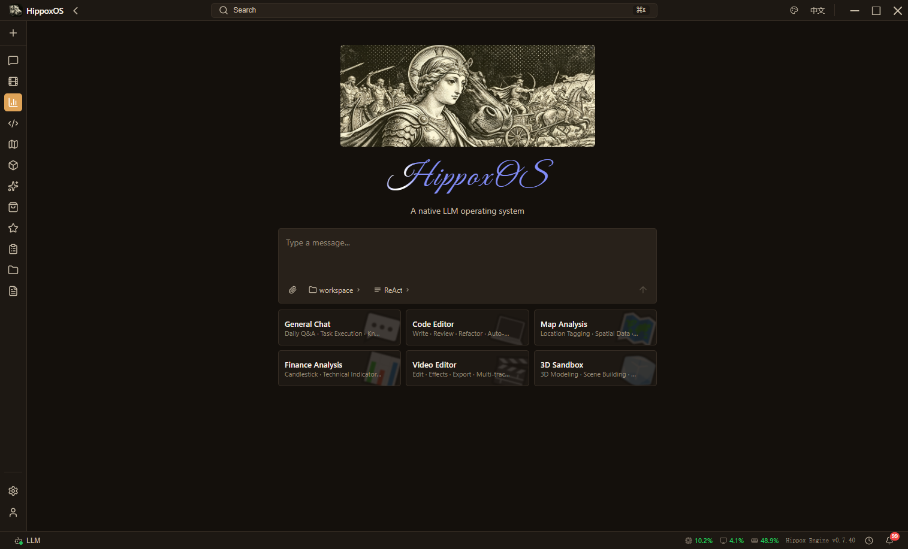
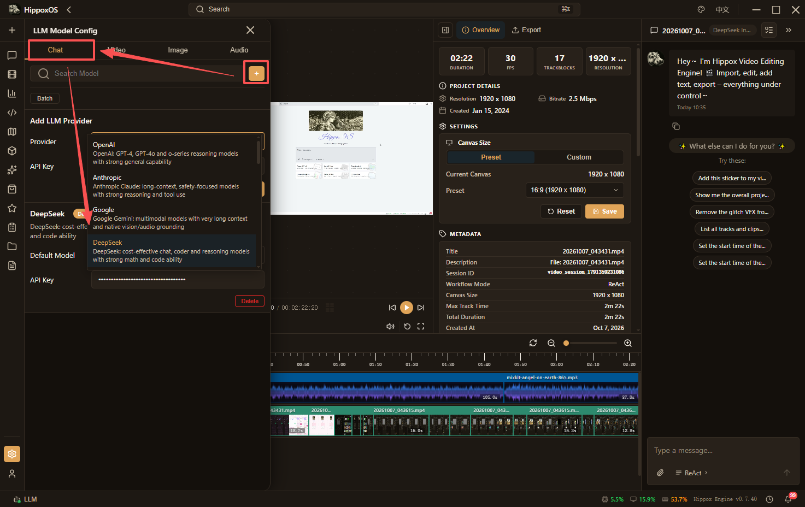
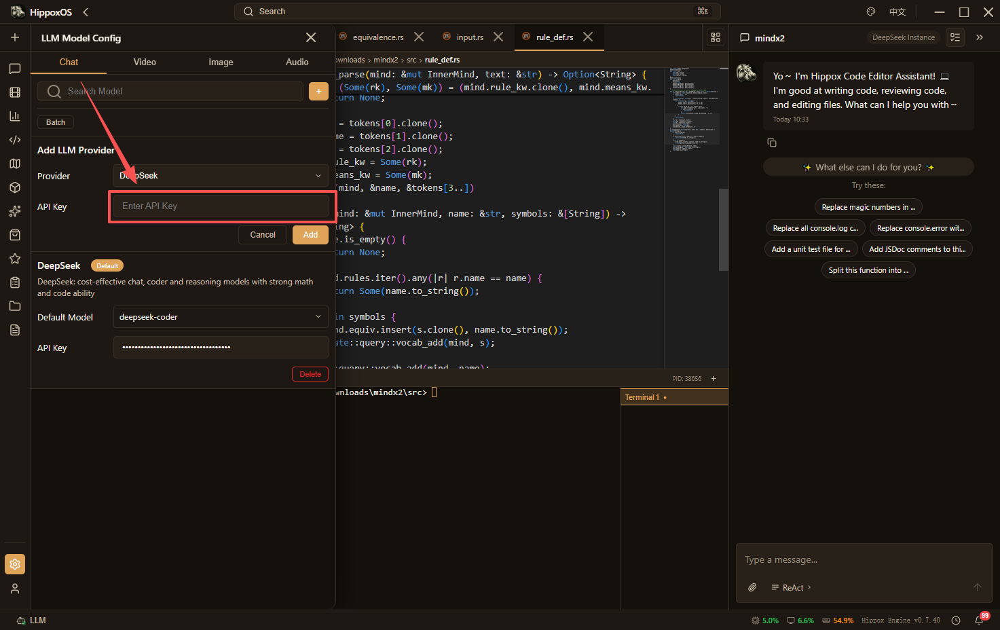
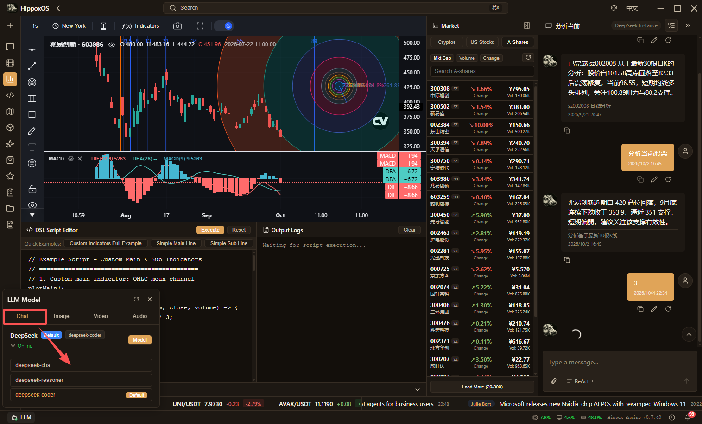
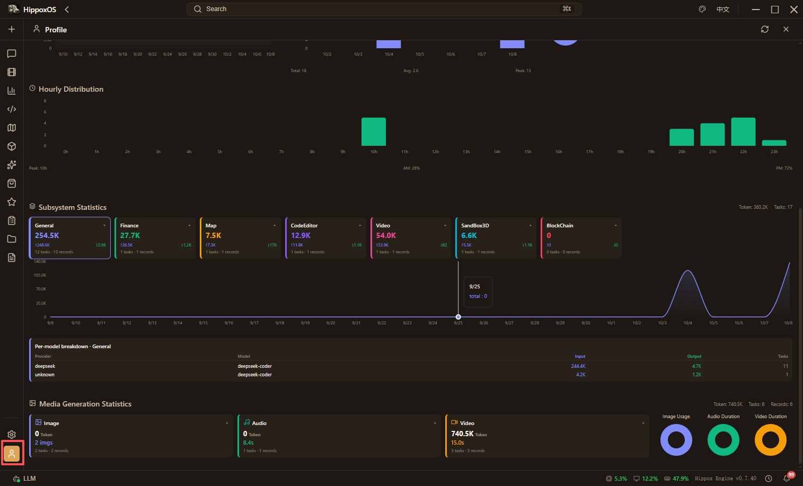

[English](./hippoxOS.md) | [简体中文](./hippoxOS.zh-CN.md) · [← Back](../README.md)

# Integrating hippoxOS

hippoxOS is an LLM-native operating system with 6 built-in major subsystems:

- **General Chat**: Control your computer with natural language.
- **Audio & Video Editing**: Powered by a self-developed NLE engine, allowing LLMs to directly operate on the timeline using natural language.
- **Code Editor**: Users can describe development requirements in natural language, and the system drives code generation and modification. The core feature of this subsystem is the controllability of code changes—when the LLM modifies code, the system presents a diff view showing before and after changes, requiring user confirmation before applying, ensuring developers maintain full control over their codebase.
- **Financial Data Analysis**: The finance subsystem provides financial data visualization and analysis capabilities.
- **Geographic Information Analysis**: The map subsystem integrates professional-grade geographic information visualization capabilities, allowing annotations directly on maps via natural language.
- **3D Sandbox**: Provides an environment for generating and manipulating 3D scene construction through conversation.

#### 1. Install hippoxOS

- Click here to go to the download page [Click](https://github.com/HippoxHQ/hippoxOS/releases/latest).
- Choose the installer package version that matches your operating system.

| Platform | Download                                                                                                                                                                                                                                                                                                                                                                           |
| -------- | ---------------------------------------------------------------------------------------------------------------------------------------------------------------------------------------------------------------------------------------------------------------------------------------------------------------------------------------------------------------------------------- |
| Windows  | [hippoxOS_windows_x86_64.msi](https://github.com/HippoxHQ/hippoxOS/releases/latest/download/hippoxOS_windows_x86_64.msi)   [hippoxOS_windows_x86_64.exe](https://github.com/HippoxHQ/hippoxOS/releases/latest/download/hippoxOS_windows_x86_64.exe)                                                                                                                             |
| macOS    | [hippoxOS_macos_x86_64.dmg](https://github.com/HippoxHQ/hippoxOS/releases/latest/download/hippoxOS_macos_x86_64.dmg)   [hippoxOS_macos_aarch64.dmg](https://github.com/HippoxHQ/hippoxOS/releases/latest/download/hippoxOS_macos_aarch64.dmg)                                                                                                                                   |
| Linux    | [hippoxOS_linux_x86_64.AppImage](https://github.com/HippoxHQ/hippoxOS/releases/latest/download/hippoxOS_linux_x86_64.AppImage)   [hippoxOS_linux_x86_64.deb](https://github.com/HippoxHQ/hippoxOS/releases/latest/download/hippoxOS_linux_x86_64.deb)   [hippoxOS_linux_x86_64.rpm](https://github.com/HippoxHQ/hippoxOS/releases/latest/download/hippoxOS_linux_x86_64.rpm) |

#### 2. Run hippoxOS

After launching, you will see the home page:

#### 3. Connect DeepSeek Provider

- Click the settings (gear) button in the bottom left corner, then click LLM Model Configuration.

- In the drawer panel that pops up on the left, select Chat Model, and click the plus sign, then choose **DeepSeek** from the dropdown.

- Then fill in your [DeepSeek API Key](https://platform.deepseek.com/api_keys).

#### 4. Select DeepSeek Model

- Click the `Model` button in the bottom bar, then click the `Model` button in the current default `DeepSeek` model entry. A popup will appear listing the models available from the current model provider. Click to select—it comes with built-in availability detection.

#### 5. Usage Statistics

- Click the `User` button in the sidebar to switch to the Profile panel, which shows detailed usage statistics.

