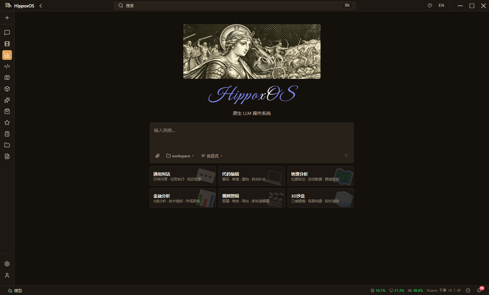
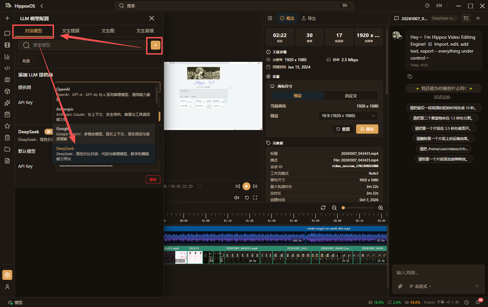
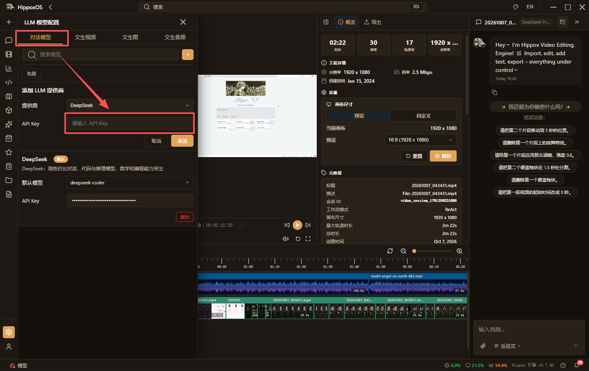
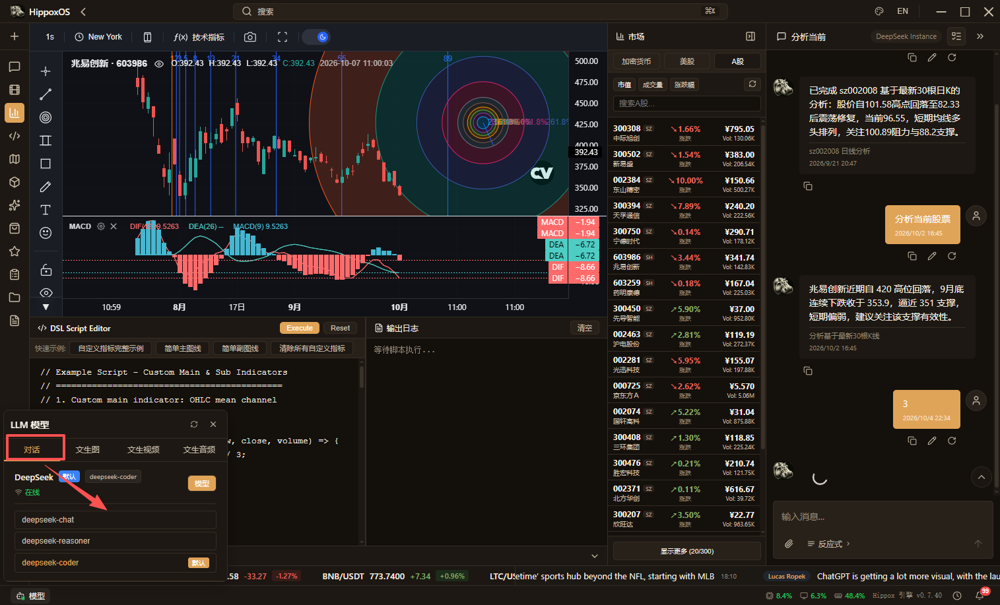
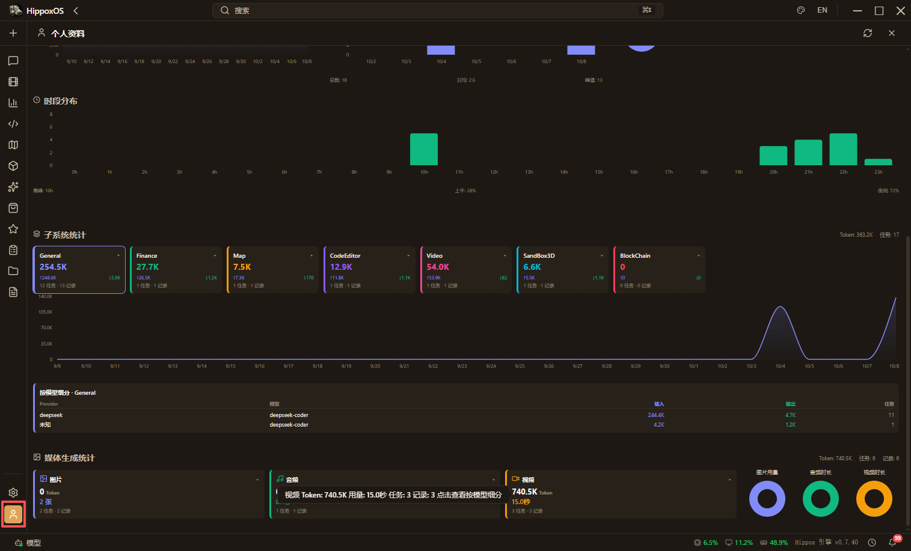

[English](./hippoxOS.md) | [简体中文](./hippoxOS.zh-CN.md) · [← 返回](../README.zh-CN.md)

# 接入 hippoxOS

hippoxOS 是一个LLM原生操作系统, 目前内置6大子系统:

- 通用对话: 用自然语言控制计算机.
- 音视频编辑: 搭载自研NLE引擎,可以使用自然语言让LLM直接对时间线进行操作.
- 代码编辑器: 用户可通过自然语言描述开发需求,系统驱动代码生成和修改,该子系统的核心特性是代码变更的可控性,当LLM对代码进行修改时,系统会以对比视图呈现修改前后的差异,用户确认后方可应用,确保开发者对代码库的完全掌控.
- 金融数据分析: 金融子系统提供金融数据可视化与分析能力.
- 地理信息分析: 地图子系统集成了专业级地理信息可视化能力, 直接直接通过自然语言在地图上进行标注.
- 3D沙盒: 提供了一个通过对话生成和操作三维场景构建的环境.

#### 1. 安装 hippoxOS

- 点击此处进入下载页 [点击](https://github.com/HippoxHQ/hippoxOS/releases/latest).
- 选择符合你操作系统的安装包版本.

| Platform | Download                                                                                                                                                                                                                                                                                                                                                                           |
| -------- | ---------------------------------------------------------------------------------------------------------------------------------------------------------------------------------------------------------------------------------------------------------------------------------------------------------------------------------------------------------------------------------- |
| Windows  | [hippoxOS_windows_x86_64.msi](https://github.com/HippoxHQ/hippoxOS/releases/latest/download/hippoxOS_windows_x86_64.msi)   [hippoxOS_windows_x86_64.exe](https://github.com/HippoxHQ/hippoxOS/releases/latest/download/hippoxOS_windows_x86_64.exe)                                                                                                                             |
| macOS    | [hippoxOS_macos_x86_64.dmg](https://github.com/HippoxHQ/hippoxOS/releases/latest/download/hippoxOS_macos_x86_64.dmg)   [hippoxOS_macos_aarch64.dmg](https://github.com/HippoxHQ/hippoxOS/releases/latest/download/hippoxOS_macos_aarch64.dmg)                                                                                                                                   |
| Linux    | [hippoxOS_linux_x86_64.AppImage](https://github.com/HippoxHQ/hippoxOS/releases/latest/download/hippoxOS_linux_x86_64.AppImage)   [hippoxOS_linux_x86_64.deb](https://github.com/HippoxHQ/hippoxOS/releases/latest/download/hippoxOS_linux_x86_64.deb)   [hippoxOS_linux_x86_64.rpm](https://github.com/HippoxHQ/hippoxOS/releases/latest/download/hippoxOS_linux_x86_64.rpm) |

#### 2. 运行 hippoxOS

启动后你会看到首页：

#### 3. 连接 DeepSeek 供应商

- 在左下角点击设置(齿轮)按钮, 点击LLM模型配置

- 在左侧弹出的抽屉面板中, 选择对话模型, 并点击加号, 在下拉框中选择 **DeepSeek**.

- 然后填入你的 [DeepSeek API Key](https://platform.deepseek.com/api_keys).

#### 4. 选择 DeepSeek 模型

- 点击下方栏中的 `模型` 按钮, 点击当前默认的 `DeepSeek` 模型条目中的 `模型` 按钮, 会弹出弹出当前模型厂商的模型列表, 点击选择即可, 自带存活检测.

#### 5. 用量统计

- 点击侧方栏中的 `用户` 按钮, 会切换至 Profile 面板, 上面有详细的用量统计.

